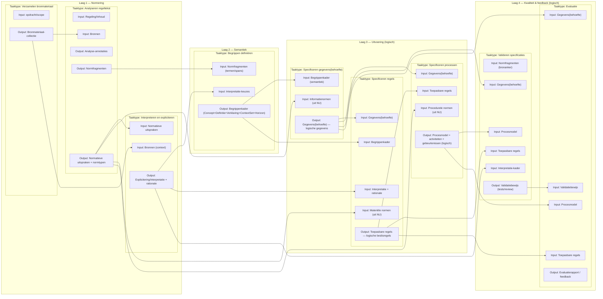

# Totaalmodel: Normering ↔ Logische uitvoering ↔ Semantiek

Dit document beschrijft het model tekstueel. Het model bestaat uit vijf samenhangende gebieden:

- **Veranderingsgebied** – wat is de aanleiding voor de regeling?
- **Wetgeving** – wat beoogt de regeling en voor wie?
- **Normering** – wat staat er in de regeling en waar zit de normatieve betekenis?
- **Uitvoering (logisch model)** – hoe wordt uitvoering logisch gemodelleerd in procesmodel, activiteiten, regels, gebeurtenissen en gegevens?
- **Semantiek (begrippenkader)** – wat betekenen termen/gegevens/regels precies en hoe borg je eenduidige definities en verklaringen?

> **Scope-afspraak:** het uitvoeringsmodel is volledig logisch. Er worden geen technische implementaties (code, services, API's, dataformaten, algoritmen/engines) gemodelleerd.

## Inhoudsopgave

- [1. Veranderingsgebied](#1-veranderingsgebied)
- [2. Wetgeving](#2-wetgeving)
- [3. Normeringlaag (Normatief)](#3-normeringlaag-normatief)
- [4. Uitvoeringslaag (Logisch uitvoeringsmodel)](#4-uitvoeringslaag-logisch-uitvoeringsmodel)
- [5. Semantieklaag (Begrippenkader)](#5-semantieklaag-begrippenkader)
- [6. Samenhang: Normering ↔ Uitvoering](#6-samenhang-normering--uitvoering)
- [7. Samenhang: Semantiek ↔ Normering én ↔ Uitvoering](#7-samenhang-semantiek--normering-en--uitvoering)
- [8. Leesroute door het model (van wet naar loket, logisch)](#8-leesroute-door-het-model-van-wet-naar-loket-logisch)
- [9. Architectuursturing en toetsing](#9-architectuursturing-en-toetsing)
- [10. Taakgerichte uitwerking (verdiepend diagram)](#10-taakgerichte-uitwerking-verdiepend-diagram)

## 1. Veranderingsgebied

Het veranderingsgebied beschrijft de aanleiding voor het ontstaan of wijzigen van een regeling. Het vormt de brug tussen een maatschappelijk probleem en de juridische reactie daarop.

### 1.1 Bouwstenen

- **Probleem** – een geconstateerd maatschappelijk probleem of knelpunt dat actie vereist.
- **Veranderingsbehoefte** – de uit het probleem voortkomende behoefte aan verandering (beleidsmatig of juridisch).
- **Veranderingsvoorstel** – een concreet voorstel dat de veranderingsbehoefte vertaalt naar een (wijziging van een) regeling.
- **Belangengroep** *(gedeeld met Wetgeving)* – de groep(en) op wie de regeling betrekking heeft of door wie de behoefte wordt gedragen.

### 1.2 Samenhang

- **Probleem → Veranderingsbehoefte** – een probleem leidt tot een gearticuleerde behoefte aan verandering.
- **Veranderingsbehoefte → Veranderingsvoorstel** – de behoefte wordt uitgewerkt in een concreet voorstel.
- **Veranderingsvoorstel → Regeling** – het voorstel wijzigt of introduceert een regeling.
- **Veranderingsvoorstel → Belangengroep** – het voorstel heeft betrekking op een of meer belangengroepen.

## 2. Wetgeving

De wetgevingslaag beschrijft wat de regeling beoogt en voor wie zij bedoeld is. Deze laag vormt de brug tussen het veranderingsgebied (aanleiding) en de normeringlaag (inhoud).

### 2.1 Bouwstenen

- **Regeling** – het juridische instrument (wet, AMvB, beleidsregel, e.d.) dat de norm vastlegt.
- **Doel** – het beoogde maatschappelijke of beleidsmatige doel van de regeling.
- **Beoogd effect** – het verwachte effect van de regeling in de praktijk.
- **Belangengroep** – de doelgroep(en) waarop de regeling van toepassing is of voor wie zij bedoeld is.

### 2.2 Samenhang

- **Regeling → Doel** – een regeling heeft één of meer doelen.
- **Regeling → Beoogd effect** – een regeling beoogt een effect in de maatschappij of uitvoeringspraktijk.
- **Regeling → Belangengroep** – een regeling is bedoeld voor een of meer belangengroepen.

> **Opmerking:** de Regeling is tevens het startpunt van de normeringlaag (zie §3): zij bevat de Structuuronderdelen die leiden tot Normfragmenten en Normatieve uitspraken.

## 3. Normeringlaag (Normatief)

### 3.1 Bronstructuur
De normeringlaag modelleert de juridische bron in lagen van steeds fijnmaziger onderdelen:

- **Regeling** – het juridische instrument (wet/regeling/beleidsregel).
- **Structuuronderdeel** – tekststructuur (bijv. hoofdstuk/afdeling/artikel/lid), inclusief nesting (onderdeel-van).
- **Inhoud** – de feitelijke tekstinhoud binnen een structuuronderdeel.
- **Normfragment** *(trace-unit)* – de kleinste herleidbare eenheid in de bron waarop traceability wordt gebaseerd.
- **Normatieve uitspraak** – een normfragment bevat één of meerdere normatieve uitspraken (bv. verplichting, bevoegdheid, termijn, voorwaarde, informatieplicht).

### 3.2 Normtypen (classificatie van normatieve uitspraken)
Elke normatieve uitspraak kan één of meer normtypen betreffen:

- **Bevoegdheidsnorm** – over bevoegdheid, mandaat en verantwoordelijkheid (wie mag/moet handelen).
- **Procedurele norm** – over proces- en procedurevoorschriften (volgorde, termijnen, berichtmomenten).
- **Materiële norm** – over inhoudelijke criteria, voorwaarden en gevolgen (beslisinhoud).
- **Informatienorm** – over informatieverplichtingen (welke gegevens/documenten moeten worden aangeleverd/verstrekt).

> **Opmerking:** een normatieve uitspraak kan meerdere normtypen tegelijk raken (bijv. materieel + informatieplicht + procedureel).

## 4. Uitvoeringslaag (Logisch uitvoeringsmodel)

### 4.1 Uitvoeringselementen (logisch)
In de uitvoeringslaag wordt de uitvoering als logisch model beschreven, niet als implementatie:

- **Procesmodel** – logische procesbeschrijving (bv. BPMN-achtig), met stappen en beslismomenten.
- **Activiteit** – logische processtap binnen het procesmodel.
- **Regel** *(toepasbaar/logisch)* – logische beslisregel (bijv. DMN-achtig), gebruikt in activiteiten.
- **Gegeven** *(logisch)* – logisch informatie-element (gegevensbehoefte), nodig als input of ontstaan als output.
- **Gebeurtenis** *(logisch)* – business event, trigger of termijnmoment (bv. "aanvraag ontvangen", "termijn verstreken").
- **Handelingtype** *(juridisch)* – type juridische handeling dat de uitvoering beoogt te realiseren (bv. "beschikking nemen", "vergunning verlenen/weigeren").

### 4.2 Interne samenhang in de uitvoeringslaag (keten)
De uitvoering is een samenhangend netwerk met minimaal deze relaties:

- **Gebeurtenis → Procesmodel** – triggert of vormt de startconditie voor een procespad.
- **Procesmodel → Activiteit** – omvat de processtappen waaruit het model bestaat.
- **Activiteit → Regel** – gebruikt regels om te beslissen.
- **Regel → Gegeven** *(vereist)* – inputgegevens die nodig zijn voor de regel.
- **Regel → Gegeven** *(levert)* – outputgegevens die de regel oplevert.
- **Activiteit → Handelingtype** – realiseert het beoogde juridische handelingtype.
- **Gebeurtenis → Gegeven** *(optioneel)* – een gebeurtenis kan gegevens (bericht/document) met zich meedragen.

> **Opmerking:** de relaties *vereist* en *levert* (4 en 5) zijn cruciaal voor interoperabiliteit: ze maken expliciet welke informatie in- en uitgaat bij regels.

## 5. Semantieklaag (Begrippenkader)

### 5.1 Doel van de semantieklaag
De semantieklaag borgt eenduidige betekenis van:

- termen in normfragmenten,
- gegevens in uitvoering,
- begrippen gebruikt in regels,
- objecten waarop procesmodel, activiteiten, gebeurtenissen en handelingtypes betrekking hebben.

### 5.2 Bouwstenen

- **Concept** – het begrip (bedoelde betekenis).
- **Definitie** – elk concept heeft precies één definitie (1..1).
- **Verklaring** – een definitie heeft één of meer verklaringen (1..*) die onderbouwen en preciseren. Een verklaring kan een onderwerp (`heeftSubject`) en een object (`heeftObject`) hebben, beide verwijzend naar andere concepten.

## 6. Samenhang: Normering ↔ Uitvoering
Deze sectie beschrijft hoe normatieve uitspraken direct doorwerken in procesmodel, regels, gebeurtenissen, gegevens en handelingtype — zonder een aparte operationalisatie-laag.

### 6.1 Projectie van normtypen naar logische uitvoering
De normtypen fungeren als projectieregels:

- **Bevoegdheidsnorm → Handelingtype** – bepaalt welk juridisch handelingtype door de uitvoering kan/moet worden gerealiseerd.
- **Procedurele norm → Procesmodel** – stuurt de logische processtructuur (fasering, volgorde, termijnen).
- **Procedurele norm → Gebeurtenis** – introduceert logische gebeurtenissen (deadline, startmoment, notificatie).
- **Materiële norm → Regel** – wordt uitgewerkt als logische beslisregels.
- **Informatienorm → Gegeven** – bepaalt welke gegevens logisch nodig/vereist zijn.
- **Informatienorm → Gebeurtenis** – koppelt de informatieplicht aan een aanlevermoment (bij aanvraag/melding/binnen termijn).

- **Materiële norm → Handelingtype** *(optioneel)* – maakt expliciet dat materiële criteria direct bepalen of "verlenen/weigeren" mogelijk is.

## 7. Samenhang: Semantiek ↔ Normering én ↔ Uitvoering
Semantiek is geen vervanging voor normatief→uitvoering, maar een tweede (parallelle) koppeling die betekenis borgt.
### 7.1 Semantiek koppelt aan normering (tekstankering)

- **Normfragment → Concept** (`verwijstNaarConcept`)
- **Normatieve uitspraak → Concept** (`betreftConcept`) – maakt expliciet welke begrippen een uitspraak inhoudelijk raakt.

### 7.2 Semantiek koppelt aan uitvoering (betekenis van modellen)

- **Gegeven → Concept** (`heeftBetekenis`)
- **Regel → Concept** (`gebruiktConcept`)
- **Procesmodel → Concept** (`caseObjectConcept`)
- **Activiteit → Concept** (`verwerktConcept`)
- **Gebeurtenis → Concept** (`betreftConcept`)
- **Handelingtype → Concept** (`betreftConcept`)

Dit maakt consistentietoetsing mogelijk, bijvoorbeeld:

- Gebruikt een regel concepten die ook in normfragmenten voorkomen?
- Hebben alle gegevens een semantische betekenis (concept)?
- Is de naam van een gebeurtenis gekoppeld aan het concept waarop deze betrekking heeft?

## 8. Leesroute door het model (van wet naar loket, logisch)

1. Regeling → Structuuronderdeel → Inhoud → Normfragment
2. Normfragment bevat Normatieve uitspraken
3. Normatieve uitspraken worden geclassificeerd in normtypen
4. Normtypen projecteren naar logische uitvoering:
   - bevoegdheid → handelingtype
   - procedure → procesmodel + gebeurtenis
   - materieel → regel
   - informatie → gegeven + gebeurtenis
5. In de uitvoering:
   - gebeurtenis start procesmodel
   - procesmodel omvat activiteiten
   - activiteiten gebruiken regels
   - regels vereisen/leveren gegevens
   - activiteiten realiseren handelingtype
6. Semantiek verbindt alle lagen: normfragmenten en uitvoeringselementen verwijzen naar Concepten, met definities en verklaringen.

## 9. Architectuursturing en toetsing

Dit hoofdstuk maakt het model bestuurbaar voor architectuurkeuzes, implementatie-aansturing en kwaliteitsborging.

### 9.1 Architectuurprincipes

- **P1. Regelgeving is leidend** – wijzigingen starten in Regeling/Normering en worden pas daarna doorvertaald naar Uitvoering.
- **P2. Semantiek is verplicht** – elk Gegeven, elke Regel en elk relevant normfragment verwijst naar één of meer Concepten.
- **P3. Traceability by design** – elke logische beslissing en elk handelingtype is herleidbaar naar normatieve uitspraken.
- **P4. Logisch vóór technisch** – technische keuzes (services, APIs, engines) volgen pas na expliciete modellering van proces, regels, gegevens en semantiek.
- **P5. Wijzigbaar zonder breuk** – veranderingen in normtypen of definities moeten impacteerbare artefacten expliciet aanwijzen.
- **P6. Begrensde complexiteit** – modeluitbreidingen worden alleen toegevoegd als ze een bestuurlijke of uitvoeringsvraag beantwoorden.

### 9.2 Kwaliteitsattributen en toetscriteria

- **Traceerbaarheid**: van Regel/Handelingtype terug naar Normatieve uitspraak en Regeling.
- **Interoperabiliteit**: per Regel zijn vereiste en geleverde Gegevens expliciet en eenduidig gedefinieerd.
- **Uitlegbaarheid**: beslisuitkomsten zijn te verklaren via Regel + Concept + Definitie/Verklaring.
- **Wijzigbaarheid**: bij wijziging van een normtype is duidelijk welke processen, regels, gebeurtenissen en gegevens geraakt worden.

```mermaid
flowchart LR

  %% ---------------- WETGEVING ----------------
  subgraph W[Wetgeving]
    Reg[Regeling]
    D[Doel]
    BG[Belangengroep]
    BE[Beoogd effect]

    Reg -->|heeft| D
    Reg -->|beoogt| BE
    Reg -->|bedoeld voor| BG
  end

  %% ---------------- VERANDERINGSGEBIED ----------------
  subgraph VG[Veranderingsgebied]
    P[Probleem]
    VV[Veranderingsvoorstel]    
    VB[Veranderingsbehoefte]

    VV -->|betrekking op| BG
    VB -->|leidt tot| VV
    P -->|leidt tot| VB
    VV -->|wijzigt| Reg
  end
  
  %% ---------------- NORMERING ----------------
  subgraph N[Normering]
    SO[Structuuronderdeel]
    Inh[Inhoud]
    NF[Normfragment]
    NU[Normatieve uitspraak]
    BN[Bevoegdheidsnorm]
    PN[Procedurele norm]
    MN[Materiële norm]
    IN[Informatienorm]

    Reg -->|bevat| SO
    SO -->|bevat| Inh
    Inh -->|heeft| NF
    NF -->|bevat| NU
    NU -->|betreft| BN
    NU -->|betreft| PN
    NU -->|betreft| MN
    NU -->|betreft| IN
  end

  %% ---------------- SEMANTIEK ----------------
  subgraph S[Semantiek / Begrippenkader]
    C[Concept]
    Def[Definitie]
    V[Verklaring]

    C -->|heeftDefinitie| Def
    Def -->|heeftVerklaring| V
    V --> |heeftObject| C
    V --> |heeftSubject| C

    NF -->|verwijstNaarConcept| C
    NU -->|betreftConcept| C
  end

  %% ---------------- UITVOERING (MODEL) ----------------
  subgraph U["Uitvoering (model)"]
    HT[Handelingtype]
    PM[Procesmodel]
    Act[Activiteit]
    Evt[Gebeurtenis]
    Rule[Regel]
    Data[Gegeven]

    Evt -->|triggertStartconditie| PM
    PM -->|omvatStappen| Act
    Act -->|gebruiktRegel| Rule
    Rule -->|vereist| Data
    Rule -->|levert| Data
    Act -->|realiseertHandelingtype| HT
    Evt -->|draagtGegeven| Data

    Data -->|heeftBetekenis| C
    Rule -->|gebruiktConcept| C
    PM -->|caseObjectConcept| C
    Act -->|verwerktConcept| C
    Evt -->|betreftConcept| C
    HT -->|betreftConcept| C
  end

  %% ----------- NORMTYPE -> UITVOERING (DIRECTE BRUG) -----------
  BN -->|machtigtHandelingtype| HT
  PN -->|procedurevoorschrift| PM
  PN -->|termijnOfTrigger| Evt
  MN -->|besliscriterium| Rule
  IN -->|aanleverplicht| Data
  IN -->|aanlevermoment| Evt
```

## 10. Taakgerichte uitwerking (verdiepend diagram)

Onderstaand diagram is een procesmatige verdieping op het kernmodel hierboven. Waar hoofdstuk 3 t/m 7 vooral de structurele samenhang tussen objecttypen en relaties beschrijft, toont dit diagram de taaktypen, artefactstromen en feedbacklus die nodig zijn om van bronmateriaal naar logisch uitvoerbare specificaties te komen.

### 10.1 Relatie met de hoofdstukken

- **Laag 1 (Normering)** sluit aan op hoofdstuk 3: bronanalyse levert Normfragmenten en Normatieve uitspraken op.
- **Laag 2 (Semantiek)** sluit aan op hoofdstuk 5 en 7: interpretatie en normfragmenten worden vertaald naar Begrippenkader.
- **Laag 3 (Uitvoering logisch)** sluit aan op hoofdstuk 4 en 6: normen en semantiek worden uitgewerkt naar gegevensbehoefte, regels en procesmodel.
- **Laag 4 (Kwaliteit en feedback)** operationaliseert hoofdstuk 9: validatie en evaluatie leveren stuurinformatie voor bijstelling.

### 10.2 Hoe dit diagram te lezen

- Lees van links naar rechts als artefactstroom tussen lagen, en van boven naar beneden als taaksequentie per laag.
- Inputs en outputs binnen een taaktype maken expliciet welke overdrachtsproducten minimaal nodig zijn voor de volgende stap.
- De kruis-lane pijlen onderaan zijn de architectonisch relevante afhankelijkheden tussen artefacten.
- De validatie- en evaluatiestappen vormen een gesloten feedbacklus: ontwerpbeslissingen worden getoetst en waar nodig teruggelegd in interpretatie, semantiek of uitvoering.

### 10.4 Interpretatielegenda

- Input betekent vereist bronartefact om een taaktype te starten.
- Output betekent minimaal overdrachtsproduct dat beschikbaar moet zijn voor vervolgstappen.
- Pijlen binnen een laag tonen taakinterne of taaksequentiele afhankelijkheden.
- Kruis-lane pijlen tonen architectonisch relevante overdracht tussen lagen en disciplines.
- Validatiebewijs en Evaluatierapport zijn governance-artefacten: ze onderbouwen go/no-go en terugkoppeling.

