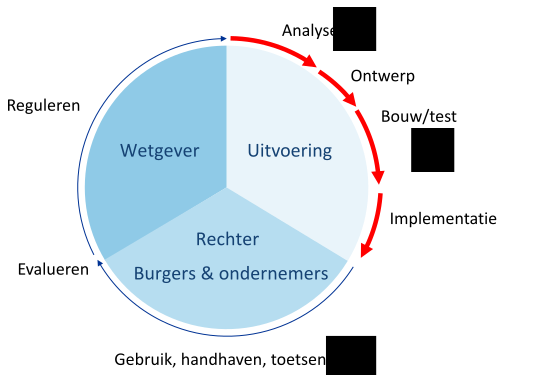
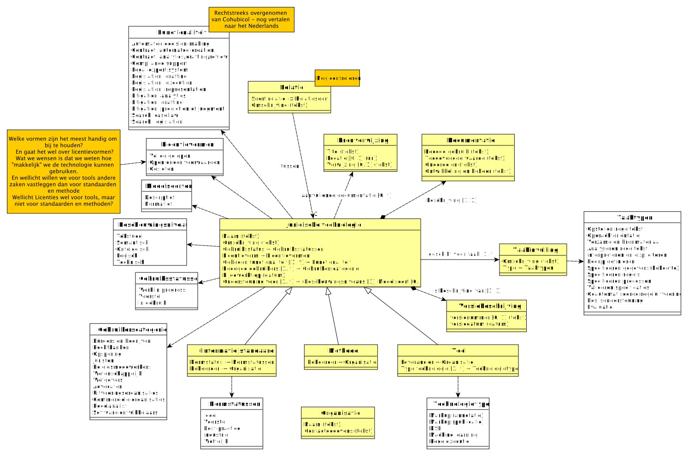

# Typologie voor juridische technologie

Deze typologie (of "model") is een manier om juridische technologie te kunnen beschrijven en met elkaar te vergelijken. Het model is afgeleid van de typology of legal technologies, zoals beschikbaar op: https://publications.cohubicol.com/typology

Potentieel kan deze typologie beschikbaar komt op https://regels.overheid.nl en daarmee een invulling geven aan de (huidige) onderdelen "standaarden" en "regels/methoden".

## Juridische technologie ("legal technology")

Onder «juridische technologie» verstaan we een methode, standaard of tool die gebruikt wordt bij de totstandkoming van wet- en regelgeving, de doorvertaling naar de uitvoering en het gebruik in de uitvoering, rechtsgang, en uiteindelijk evaluatie. Met andere woorden: de gehele beleidscyclus.

Hierbij geldt:

- Een **methode** is een gestructureerde, herhaalbare aanpak (stappenplan met technieken en keuzes) om een doel te bereiken of een taak uit te voeren. Een methode beschrijft hoe je te werk gaat (en evt. In welke volgorde) en kan verwijzen naar standaarden als hulpmiddel. Een methode beschrijft hoe een taak wordt uitgevoerd.
- Een (informatie)**standaard** is een gedocumenteerde set van afspraken (regels/eisen/definities/specificaties) over welke informatie uitgewisseld of vastgelegd wordt om een doel te bereiken of een taak uit te voeren. Een (informatie)standaard beschrijft wat het resultaat van een taak is.
- Een **tool** is een voorziening die ondersteuning biedt om een doel te bereiken of een taak uit te voeren. De beschrijving van een tool geeft aan waarmee een taak wordt uitgevoerd.

## "Juridische" taken

Onder een «taak» verstaan we een afgebakende hoeveelheid werk die leidt tot een overdraagbaar resultaat en die bijdraagt aan het behalen van een doel. Binnen de context van dit model betreft dit taken die bijdragen aan het doel om tot wet- en regelgeving te komen en/of tot de uitvoering van deze wet- en regelgeving te komen.

We onderscheiden de volgende juridische taken van wet naar loket, de taken op de rode lijn uit het figuur op de voorgaande pagina. Daarbij zijn de eerste en de laatste taak niet alleen van toepassing op de rode lijn, maar ook daarbuiten:

- Opstellen regeltekst vindt zowel in de uitvoering als bij de wetgever plaatst. De wetgever stelt de wet in formele zin op, de uitvoeringsorganisatie stelt beleidsregels op. Daarnaast nemen we deze taak mee, omdat de andere taken eisen stellen aan de wijze waarop een regeltekst wordt opgesteld.
- Evalueren beleid vindt met name plaats bij de wetgever, maar ook de andere spelers hebben een belangrijke rol bij het evalueren van het beleid. Daarnaast nemen we deze taak mee, omdat het evalueren van het beleid eisen zal stellen aan de (resultaten van) de andere taken.

|Taak|Definitie|
|----|---------|
|Opstellen regeltekst|Opstellen van juridische tekst als onderdeel van het geschreven recht: de algemeen verbindende voorschriften, inclusief beleidsregels.|
|Opdrachtoriëntatie|Bepalen waaruit de opgave bestaat die opgepakt wordt, dwz: het doel dat voor ogen staat. In geval er nog geen regelgeving is, zal dit doel vermoedelijk als maatschappelijk effect geformuleerd zijn, als de regelgeving er al is, kan het doel de uitvoering van deze (nieuwe of gewijzigde) regelgeving zijn.|
|Verzamelen bronmateriaal|Verzamelen van de relevante bronnen die nodig zijn voor de betreffende opgave. Dit omvat de juridische teksten, maar ook andere teksten die relevant kunnen zijn voor de interpretatie van deze teksten (rechtvinding), zoals de parlementaire geschiedenis, de huidige manier van werken, etc, etc.|
|Analyseren regeltekst|Een gestructureerde manier waarin de betekenis, structuur en bedoeling van een juridische tekst wordt onderzocht, zoals deze feitelijk uit de tekst blijkt. Deze stap omvat strikt genomen nog niet de interpretatie van de juridische tekst. In de praktijk al deze taak in samenhang met de taak interpreteren en expliciteren worden uitgevoerd.|
|Interpreteren en expliciteren|Het interpreteren van een juridische tekst en de betekenis en bedoeling daarvan op een gestructureerde manier vastleggen. Dit lijkt op rechtsvinding (en ook rechtsvorming (!)), maar is in dit geval niet bedoeld voor een individueel geval.|
|Begrippen definiëren|Het gestructureerd beschrijven van de betekenis die met een term wordt bedoeld in een specifieke context.|
|Specificeren gegevens(-behoefte)|Het uitvoerbaar maken van wet- en regelgeving door te specificeren welke gegevens nodig zijn ten behoeve van een wettelijke taak.|
|Specificeren regels|Het uitvoerbaar maken van wet- en regelgeving door te specificeren welke regels uitgevoerd moeten worden ten behoeve van een wettelijke taak. Met "regel" wordt hier een regel bedoeld in de vorm van een algoritme of functie die op basis van aangeboden gegevens komt tot een resultaat (in de vorm van gegevens).|
|Specificeren processen|Het uitvoerbaar maken van wet- en regelgeving door te specificeren welke processen uitgevoerd moeten worden ten behoeve van een wettelijke taak.|
|Valideren specificaties|Het valideren of (gegevens, regel en/of proces-)specificaties overeen komen met de juridische teksten en de interpretatie die aan deze teksten moet worden gegeven.|
|Geautomatiseerde regeluitvoering|Het geautomatiseerd uitvoeren van regels, of delen van regels, zonder menselijke tussenkomst.|
|Beslisondersteuning|Ondersteuning aan ambtenaren bij de uitvoering van regels.|
|Evaluatie beleid|Het gestructureerd beoordelen of de implementatie en uitvoering van wet- en regelgeving in de praktijk overeenkomen met de met de beleidsdoelen beoogde effecten.|

Deze opsomming suggereert een bepaalde volgordelijkheid. Deze is er in de praktijk ook wel, maar hoeft niet zo hard te zijn. Zo is het al mogelijk om begrippen te definiëren zoals deze uit een wet in formele zin af te leiden zijn, terwijl op dat moment de onderliggende regelgeving nog niet beschikbaar is. Het opstellen van de tekst van deze onderliggende regelgeving zou dan pas na het definiëren van deze begrippen volgen (waarop mogelijk ook deze begrippen preciezer kunnen worden gedefinieerd).

## Beschrijving van de juridische technologie

Van elke juridische technologie geven we een beschrijving die bestaat uit drie onderdelen:
1.  De wijze waarop de technologie invulling geeft of ondersteuning biedt aan één of meerdere juridische taken, vastgelegd met een enkel woord of een enkel beschrijvend zinnetje, eventueel met een verwijzing naar (externe) documentatie.
2. Een lijst met kenmerken die de betreffende technologie typeert. Deze lijst bestaat uit de volgende kenmerken:
  1. Of sprake is van een methode, tool of standaard;
  2. De naam van de technologie;
  3. De gebruiksstatus van de technologie (work-in-progress, in gebruik, voorgesteld, etc);
  4. De normstatus van de technologie (voorstel, best-practice, industrie standaard, wettelijke standaard, etc);
  5. Het soort technologie (zoals: DSL, markup taal, machine learning, etc);
  6. De functionaliteit die wordt geboden (search, drafting, analysing, etc);
  7. De beoogd gebruikers (IT-ers, juristen, rechters, etc);
  8. Het beschouwingsniveau (tekstueel, semantisch, ontologisch, logisch, technisch) en het soort model (descriptief, normatief) waarvoor de technologie kan worden ingezet;
  9. De beheerder c.q. leverancier van de technologie;
  10. De versie van de technologie zoals die is bekeken (nummer en/of datum);
  11. De datum waarop de technologie is opgenomen in de typologie en de datum waarop deze beschrijving voor het laatst is bijgewerkt.
3. Een tekstuele beschrijving van de technologie, waarin de volgende zaken worden benoemd:
  1. Een beschrijving van het doel waarvoor de technologie kan worden gebruikt;
  2. Een omschrijving van de onderdelen waaruit de technologie bestaat;
  3. De makers/beheerders van de technologie;
  4. Een overzicht van aanvullende documentatie die over deze technologie bekeken kan worden.

## Welke vorm heeft een "regel"?

De taken waarvoor juridische technologie worden ingezet hebben allemaal min-of-meer te maken met het opstellen, duiden, vertalen of toepassen van regels, in allerlei verschillende vormen. Dit maakt dat de term "regel" pas betekenis krijgt binnen de taak zelf. Niet voor niets is sprake van een cirkel: je kunt niet echt zeggen waar de "regel" in zijn oorsprong ontstaat, hooguit op welk moment een bepaalde verschijningsvorm van die regel ontstaat. Daarbij doorloopt het "leven" van een verschijningsvorm van een regel een aantal stadia:

1.	De (verschijningsvorm van een) regel is opgetekend;
2.	De(verschijningsvorm van een)  regel is vastgesteld;
3.	De (verschijningsvorm van een) regel is bekendgemaakt;
4.	De (verschijningsvorm van een) regel is in werking;
5.	De (verschijningsvorm van een) regel is in gebruik;
6.	De (verschijningsvorm van een) regel is vervallen;
7.	De (verschijningsvorm van een) is verwijderd.

Stadia kunnen gecombineerd worden en niet elke verschijningsvorm "haalt" alle stadia. Eenmaal opgetekend, gedraagt een (verschijningsvorm van) een regel zich als een gegeven. De levenscyclus van een verschenen regel lijkt dan ook sterk op de levenscyclus van een gegeven.

Herleidbaarheid van een regel gaat daarmee feitelijk om de relatie tussen verschijningsvormen van regels. Zo zou je een algoritme die een regel uitvoert kunnen herleiden naar de tekst in wet- en regelgeving waarin die regel is opgetekend. Er is sprake van twee verschijningsvormen van dezelfde regel. Daarbij kunnen de stadia verschillen. Het is zelfs mogelijk dat een algoritme al in gebruik is, terwijl de juridische tekst nog niet eens is opgetekend (bijvoorbeeld bij het doorrekenen van een scenario tijdens beleidsvorming).

Juridische technologie kan geordend worden naar de vorm die de regel aanneemt die binnen een taak wordt uitgevoerd en waar die juridische technologie ondersteuning aan biedt. We maken daarbij onderscheid tussen het beschouwingsniveau en het soort uitspraak dat met de regel wordt gedaan.

> Aandachtspunt: hoe past de DSO-terminologie van juridische regel, toepasbare regel en uitvoerbare regel in dit model?

### beschouwingsniveau

We onderkennen vijf beschouwingsniveaus:

- *Tekstueel*: de regel kent een tekstuele vorm. Alle (huidige) juridische teksten en de meeste voor mensen bedoelde instructies kennen deze vorm. Kenmerkend aan een tekstuele vorm is de noodzaak tot interpretatie voordat de regel kan worden toegepast.
- *Semantisch*: de regel kent een vorm die duiding geeft aan de semantiek van de gebruikte woorden. Kenmerkend aan een semantische vorm is eenduidigheid van betekenis binnen een specifieke context, terwijl gelijktijdig er nog steeds interpretatie nodig is voordat die betekenis vast staat. Met andere woorden het is duidelijk dat er sprake is van één betekenis, maar nog niet precies welke.
- *Ontologisch*: de regel kent een vorm die duiding geeft welke feiten er kunnen gelden en hoe feiten afgeleid kunnen worden van reeds vastgestelde feiten. Dergelijke regels zijn eenduidig toepasbaar.
- *Logisch*: de regel kent een vorm die uit te drukken is in uitvoerbare logica.
- *Technisch*: de regel kent een vorm die executeerbaar is voor een specifieke technologie.

Merk op: er zijn regels die slechts tot op het semantische niveau zijn uit te drukken. Het gaat daarbij om regels waarbij het toepassen van die regel een menselijke interpretatie vereist. Een regel die de ontologische vorm heeft, heeft (in die vorm) nog slechts één mogelijke interpretatie.

De opsteller van een regelvorm heeft een bepaald doel met dit opstellen. We onderscheiden twee doelen:

- De opsteller wenst voor te schrijven hoe we de werkelijkheid moeten beschouwen, het is een descriptieve beschrijving van die werkelijkheid;
- De opsteller wenst voor te schrijven hoe de werkelijkheid zou moeten zijn, het is een normatieve beschrijving van die werkelijkheid.

De descriptieve regelvorm vertelt ons door welk "venster" we naar de wereld moeten kijken, de normatieve regelvorm vertelt ons de gevolgen van wat we zien (of dat wat we zien is toegestaan, of juist verboden is, welke gevolgen er zouden moeten zijn, op grond van wat we zien, etc.) Dit brengt ons tot het volgende model, waarin voor elke regelvorm een naam wordt gebruikt:

> Aandachtspunten: (1) zijn dit ook de namen die in de praktijk het meeste zullen aanslaan?; (2) hoe passen processen hierbinnen?]. Imperatief? Processen volgen uit de regels, maar dit wil je wel van elkaar onderscheiden! (3) OER-model (Object-event-relationship model. Methodologie van informatiesysteemontwikkeling. Wellicht even naar kijken?

<table>
<tr><th>Regelvorm</th><th>Descriptief</th><th>Normatief</th></tr>
<tr><td>Tekstueel</td><td colspan=2 align=middle>(juridische) regeltekst</td></tr>
<tr><td>Semantisch</td><td>begrip</td><td>norm</td></tr>
<tr><td>Ontologisch</td><td>categorie, kenmerk, relatie</td><td>(toepasbare) regel)</td></tr>
<tr><td>Logisch</td><td>gegevenstype</td><td>(wiskundige/logische) functie</td></tr>
<tr><td>Technisch</td><td>data-definitie</td><td>code</td></tr>
</table>

Het onderscheid tussen descriptieve regels en normatieve regels is tekstueel niet te maken: de tekstuele vorm maakt dit onderscheid niet (expliciet). Daarnaast geldt zowel een horizontale als verticale samenhang:

- Horizontaal kan een normatieve regel alleen in termen van descriptieve regels op hetzelfde niveau worden uitgedrukt, en krijgt de descriptieve regel betekenis door het gebruik in de normatieve regel.
- Verticaal betreft zal een regelvorm op een "lager" niveau de implementatie zijn van dezelfde regel uitgedrukt in een vorm op een "hoger" niveau.
